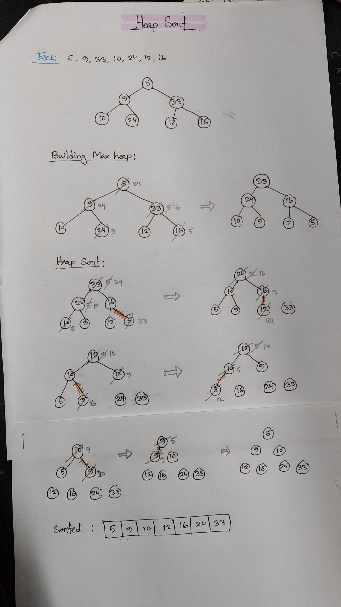

# Heap Sort

Heap Sort is a **comparison-based sorting algorithm** that uses a **binary heap data structure**.  
It works in two main phases:
1. **Build a Max Heap** from the given input array.  
2. **Repeatedly extract the maximum element** from the heap and place it at the end of the array.

---

## Example

Input array:  

```c
[5, 9, 33, 10, 24, 12, 16]
```
### Step 1: Build the Max Heap
Convert the input array into a `Max Heap` (largest element at the root).  

### Step 2: Heap Sort Process
- Swap the root (max element) with the last element.  
- Reduce the heap size and heapify again.  
- Repeat until all elements are sorted.  

## Here is it step by step


## Time & Space Complexity

- **Time Complexity**  
  - Building Heap: `O(n)`  
  - Heapify: `O(log n)`  
  - Sorting: `O(n log n)`  

- **Space Complexity:** `O(1)` 

## Resources

Here are some of the videos I used to learn Heap Sort:

- [Heap sort in 4 minutes](https://youtu.be/2DmK_H7IdTo?si=L-Aj9xNghXhK-m7P)  
- [Heap Sort | Heapify Method | Time complexity](https://youtu.be/9Qsgv--78L0?si=9qgMoy0kB6z-p-LZ)  
- [Heap Sort Explained in 3 Minutes](https://youtu.be/i7xGwTRarl0?si=W-iX5YjeDgEB8aYu)  
