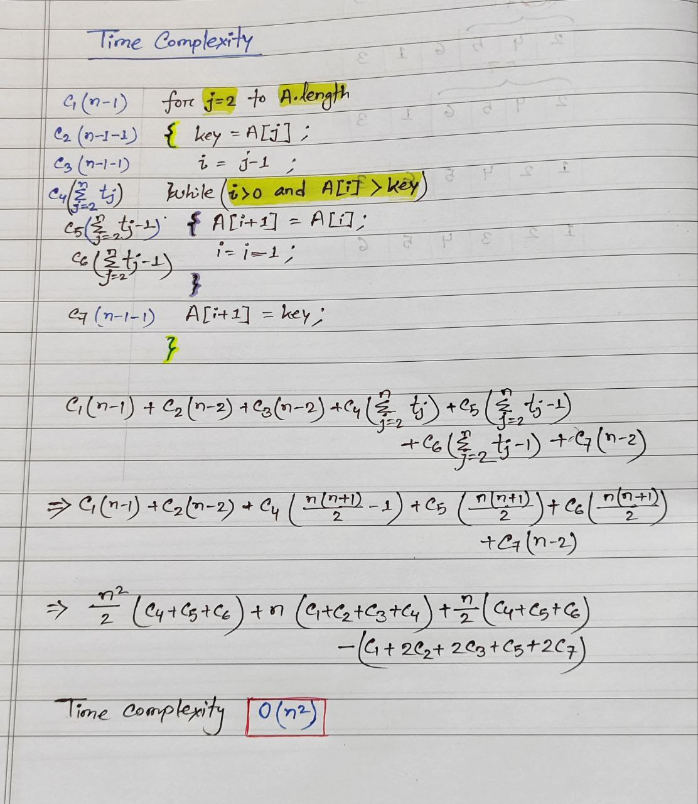

# Sorting Algorithms

1. [Insertion Sort](#insertion-sort)
   - [How it Works](#how-insertion-sort-works)
   - [Example](#for-example)
   - [Simulation](#insertion-sort-simulation)
   - [Code](#insertion-sort-code)
   - [Time Complexity](#⏱-time-complexity)

## Insertion Sort

### How insertion sort works
- Start from the `second element` (index 1).
- Compare it with the elements before it.
- Move the `larger elements to the right.
- Insert the `current element` into the correct position.
- Repeat until the list is sorted.


#### ***For example:***
We’ll use the `heights of the books` like this:
```css
Books: [5] [9] [33] [10] [24] [12] [16]
```
We'll sort them from `shortest` to `tallest` using insertion sort.
##### Step 1: Start with the second book (9)
```css
[5] [9] [33] [10] [24] [12] [16]
     ↑
 Sorted so far
```
9 is already in the correct place.
##### Step 2: Insert 33 into the sorted part
```css
[5] [9] [33] [10] [24] [12] [16]
         ↑
   Sorted so far
```
33 is larger than 9, so no movement is needed.
##### Step 3: Insert 10 into the sorted part
```css
[5] [9] [33] [10] [24] [12] [16]
              ↑
Compare 10 with 33 → move 33 one step right.
```
```css
[5] [9] [10] [33] [24] [12] [16]
              ↑
        Sorted so far
```
##### Step 4: Insert 24 into the sorted part
```css
[5] [9] [10] [33] [24] [12] [16]
                   ↑
Compare 24 with 33 → move 33 one step right
Insert 24 before 33
```
```css
[5] [9] [10] [24] [33] [12] [16]
                   ↑
             Sorted so far
```
##### Step 5: Insert 12 into the sorted part
```css
[5] [9] [10] [24] [33] [12] [16]
                        ↑
Compare 12 with 33 → move 33  
Compare 12 with 24 → move 24  
Insert 12 after 10
```
```css
[5] [9] [10] [12] [24] [33] [16]
                        ↑
                 Sorted so far
```
##### Step 6: Insert 16 into the sorted part
```css
[5] [9] [10] [12] [24] [33] [16]
                             ↑
Compare 16 with 33 → move 33  
Compare 16 with 24 → move 24  
Insert 16 after 12
```
```css
[5] [9] [10] [12] [16] [24] [33]
                             ↑
                          Sorted
```
##### Final Result: 
```css
[5] [9] [10] [12] [16] [24] [33]
```
### Insertion Sort Simulation


#### Insertion Sort Code
```
# include<iostream>
using namespace std;

void display(int A[], int size)
{
    for( int i=0; i < size; i++)
    {
        cout<< A[i] << " ";
    }
    cout << endl;
}

void insertionSort(int A[], int size)
{
    for(int j=1; j < size; j++)
    {
        int key= A[j];
        int i = j-1;

        while(i >= 0 && A[i] > key)
        {
            A[i+1] = A[i];
            i--;
        }

        A[i+1] = key;

        display(A, size);
    }

}

int main()
{
    int A[]= {5,54,154, 23, 8,1,4, 5};
    int size= sizeof(A) / sizeof(A[0]);

    insertionSort(A, size);

    return 0;
}
```


### ⏱ Time Complexity


| Case       | Time Complexity |
|------------|-----------------|
| Best       | O(n)            |
| Average    | O(n²)           |
| Worst      | O(n²)           |


